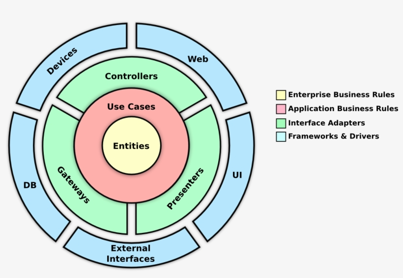

# Exemplum

[](https://github.com/ForrestTech/Exemplum/actions/workflows/build.yml)

<br/>

> An exemplum (Latin for "example", pl. exempla, exempli gratia = "for example", abbr.: e.g.) an example or model, especially a story told to illustrate a moral point.

<br/>

This is a template for creating a asp.net core applications both services (micro or otherwise and) and web applications. Currently you can create a new project based on this template using the Use this template button above.  There are plans to allow you to create a project using a Visual Studio template or the dotnet command line. The sample includes a Blazor application as an example UI but the focus of these templates is not really on UI creation but more patterns and practices on setting up asp.net services with any clients. This project is heavily inspired by other template projects like [Clean Architecture](https://github.com/jasontaylordev/CleanArchitecture) or [Ardalis](https://github.com/ardalis/CleanArchitecture). They are also great places to start they just not follow all the opinions we wanted in a template. 

## Table Of Contents

- [Exemplum](#exemplum)
  - [Table Of Contents](#table-of-contents)
  - [Getting Started](#getting-started)
    - [Using the dotnet CLI](#using-the-dotnet-cli)
    - [Using Github](#using-github)
    - [Running locally](#running-locally)
    - [Running Docker](#running-docker)
  - [Motivation](#motivation)
    - [Onion Architecture](#onion-architecture)
    - [DDD modelling](#ddd-modelling)
    - [Solution Structure](#solution-structure)
  - [Patterns Used](#patterns-used)
    - [Feature Folders](#feature-folders)
    - [Mediator Pattern](#mediator-pattern)
    - [Command Query Segregation](#command-query-segregation)
    - [Exception Handling](#exception-handling)
    - [Validation Classes](#validation-classes)
    - [Query objects](#query-objects)
    - [Cross cutting behaviour](#cross-cutting-behaviour)
    - [Authentication and Authorization](#authentication-and-authorization)
    - [Domain Events](#domain-events)
    - [Transactional Management](#transactional-management)
    - [Caching](#caching)
  - [Patterns not Used](#patterns-not-used)
    - [Shared Kernel](#shared-kernel)
    - [Common Contracts Package](#common-contracts-package)
    - [Published Clients](#published-clients)
    - [Repositories](#repositories)
  - [Testing](#testing)
    - [Test Types](#test-types)
    - [Unit tests](#unit-tests)
      - [Coverage](#coverage)
    - [Integration Tests](#integration-tests)
    - [End to End Tests](#end-to-end-tests)
    - [Load Tests](#load-tests)
  - [Technologies Used](#technologies-used)

## Getting Started

### Using the dotnet CLI

The template can be installed from the dotnet command

````
dotnet new -i Exemplum.Template
````

You can then create a new project based on Exemplum using the command

````
dotnet new exemplum -o Your.ProjectName
````

### Using Github

To get started using Github just click the big green Use this template button at the top.  This will create a new github repository for you that has a clean history.  If you want, you can then clone/fork or move this where ever you like. 

### Running locally

1. [.NET 5 SDK](https://dotnet.microsoft.com/download/dotnet/5.0)
1. Run dotnet restore on the Exemplum.sln solution 
1. Run the WebApi and WebApp project either with dotnet run or from your IDE

By default, the application is configured to run with an in memory database and within memory caching.  

Setting the `UseInMemoryStorage` setting in the WebApi app.settings folder to false will configure the application to use SqlServer (which by default is configured to use local DB) and Redis (which is by default using localhost:6379).

To use the Weather data feature of Exemplum you will need to provide an API key for [open weather map](https://openweathermap.org/).  Exemplum uses asp.net core build in local * [Secret Management](https://docs.microsoft.com/en-us/aspnet/core/security/app-secrets?view=aspnetcore-5.0&tabs=windows) system to store the API key.  To set this up locally call `dotnet user-secrets init` this will generate a local secrets file that is not stored in the repository.  Then call `dotnet user-secrets set "WeatherForecast:AppId" "{your-api-key-here}"` to add the secret. 

Exemplum is setup to use Auth0 as an authentication provider.  It is already configured with a free development account however you want be able to test all features around user Authorization without creating your own account.  You can [sign up](https://auth0.com/signup) for a free account.  You can then follow the [guide](https://auth0.com/blog/securing-blazor-webassembly-apps/) on how to integrate auth0 with Blazor.  You will need to update the Auth0 details in the api and web app `appsettings.json`.  You will also need to add a custom [rule](./auth0/add-roles-to-access-token.js) to auth0 custom rules. 

### Running Docker

Exemplum ships with configuration to run using [Project Tye](https://github.com/dotnet/tye) locally.  You can install tye using the details on the project page and run the application using `tye run`.  The project are configured to fall back to local app settings or defaults if tye service discovery information cannot be found.  

## Motivation

This project is meant to set you on the correct path when it comes to architecting solutions with .net.  It is based on design principles taken from Uncle Bobs famous [Clean Architecture](https://blog.cleancoder.com/uncle-bob/2012/08/13/the-clean-architecture.html) book and patterns like the [onion architecture](https://jeffreypalermo.com/2008/07/the-onion-architecture-part-1/) or [hexagonal architecture](https://en.wikipedia.org/wiki/Hexagonal_architecture_(software)).

### Onion Architecture

The Onion Architecture is probably best outlined by Ian cooper in one of his many good [conference talks](https://www.youtube.com/watch?v=IhR8BSZyaJ0) so I won’t go into great detail here but it’s the idea that at the core of the system is your central domain logic that should be separated from the concerns of things like web frame works or persistence. 

There is a lot of overlap between Clean, Onion and Hexagonal architecture but the idea of the onion is a compelling visualisation. 



In Exemplum we have a core domain that holds the logic for our business domain. Application concerns for each user case or request handled in the application layer.  Each use case has a single place that it is handled in the application layer.   Any interface to the system or port comes in via this Application logic.  External infrastructure like persistence or messaging is kept external to the core business domain and application logic.

### DDD modelling

> Domain-Driven Design is an approach to software development that centres the development on programming a domain model that has a rich understanding of the processes and rules of a domain

This is a very large topic and covered much better by talks like:

* [What is DDD - Eric Evans](https://www.youtube.com/watch?v=pMuiVlnGqjk)
* [Domain Driven Design: The Good Parts - Jimmy Bogard](https://www.youtube.com/watch?v=U6CeaA-Phqo)

Exemplum provides support for domain driven design concepts like

* Aggregate Roots
* Domain Entities
* Value object 
* Domain Events

It’s a very large topic and exemplum does not support all aspects of it.  We don’t use repositories for example (more on that later). Some of the most important aspects or DDD are not the technical implementation but how you gain an understanding of a business domains and its different context from interactions with domain experts and gaining a common language with which you can discuss the domain. 
You may not even need a domain model.  There is a good argument that the todo domain used in the sample is too simple to have a domain model and should really just be a transaction script.  Some parts of your system may need a domain while other could just be simple CRUD. 

### Solution Structure

1. Domain Project

    The domain project holds the core business logic for the application and should not reference any other project apart from a possible shared kernel project (more on that later).  This is where your domain entities aggregate roots and core logic will live.

1. Application Project 

    The application project holds our primary Application logic it handles all our requests be they commands or queries. Exemplum uses the mediator pattern to handle all requests.  It is the only way to interface with the domain layer.  It uses interfaces to deals with infrastructure concerns like persistence.  It only references the domain project.

1. Infrastructure Project

    The infrastructure project holds the implementation of all the service interfaces in the application project.  Concerns like persistence, messaging, caching are all implemented in the infrastructure layer.

1. Web API Project

    The web API in Exemplum is an example of a asp.net core API that handles all our application requests. It uses the mediator pattern to ensure that request are simply mapped from HTTP to a query or command object the application layer understands. 

1. Web App Project

    The Web App in Exemplum is an example of a .net Blazor web UI.  That is a client of the Web API.  Exemplum is not a project primarily concern with UI but it’s important to include an example client as well as examples of how core concepts like authentication and authorisation work that would not be as easy to demonstrate without a user interface.

## Patterns Used

### Feature Folders

Exemplum tries to group code by common feature. That is to say all the code in the application layer related to TodoLists will be in folder called `TodoLists` we don’t group code by technical implementation e.g., there is no service folder which contains application services or a model folder that contains view models or DTOs.

### Mediator Pattern

Exemplum uses the library [MediatR](https://github.com/jbogard/MediatR) to implement the [Mediator Patter](https://en.wikipedia.org/wiki/Mediator_pattern).  In this pattern all requests to the system are passed to a common mediator.  This mediator then ensures they are handled by a single handler which implements a common generic interface.  The practical upshot of this is that we have a single model for any given requests into our system and a single place it is handled.  The entry points into our system then just become the adapters outlined in the Hexagonal Architecture pattern mapping HTTP request, GRPC or ServiceBus events into application commands or queries.

### Command Query Segregation

Exemplum encourages command query segregation or [CQS](https://en.wikipedia.org/wiki/Command%E2%80%93query_separation).  This is the separation of all the requests in your system into command and queries.  By doing this it allows us to reason more about what a specific request is doing. For example, queries should never modify the state of the system a such if you see a query handler exercising behaviour on a domain object it should be seen as an anti-pattern.  Commands are expected to modify state in the system or be rejected. [CQS](https://en.wikipedia.org/wiki/Command%E2%80%93query_separation) should not be confused with [CQRS](https://martinfowler.com/bliki/CQRS.html).  They are related concepts, but CQRS takes CQS further and has totally different read write models and even paths through the system for handling read and write requests. A good outline can be found [here](https://cqrs.wordpress.com/documents/cqrs-introduction/).


### Exception Handling

Exemplum has a common exception system and a set of exception interfaces and base classes.  Your application, domain logic and infrastructure code can throw exceptions.  You will most commonly throw `Business Exceptions` or some type derived from it.  All exceptions you dont explicitly handle in your own code will be caught by a Pipeline Behaviour in the application layer.  This will log the details of the exception based on the LogLevel of the exception (business exception defaults to warning).  Exceptions can implement their own logging by implementing the `IExceptionWithSelfLogging`. There is an `IExceptionToErrorConverter` that converts a given Exception to a common `ErrorInfo` object. This provides a common data model for all exceptions.  Most properties on this `ErrorInfo` are optional. This common info object is then mapped by an MVC filter into a [problem details](https://datatracker.ietf.org/doc/html/rfc7807) API responses.

### Validation Classes

Exemplum uses [Fluent Validation](https://fluentvalidation.net/) to handle the validation of request into the system.  This allows us to encapsulate the validation logic of a given requests into a single class. It also means that the validation logic does not have to be included with the request object themselves and these can stay as POCOs.  This stops a common issue have having loads of DataAnnotation of custom validation attributes all over our request objects.  The validation classes also live in our application layer.  We use MediatR [Behaviors](https://github.com/jbogard/MediatR/wiki/Behaviors) to run validators for any request. If validation fails a ValidationException is thrown.  This is mapped to a validation problem details in the API using the Exception handling method outlined above. You can integrate Fluent Validation with asp.net API directly but this is not a great idea as what happens when you have another port into the system you will have to replicate validation there by having it as part of the request pipeline in our application logic its always applied regardless of the request origin. 

### Query objects

Exemplum uses [EF Core](https://docs.microsoft.com/en-us/ef/core/) as its primary persistence system.  As such querying uses LINQ to create rich complex queries against the data model.  However, this can result in query logic being spread all over the application layer.  Exemplum avoids this by using query objects.  Query objects implement a simple interface. 

```
    public interface IQueryObject<T>
    {
        public IQueryable<T> ApplyQuery(IQueryable<T> query);
    }
```

Then using a simple extension method, we can apply query objects to any `IQueryable<T>` in our case the EF DBSets.  This means our logic is centralised and can be unit tested.  


```
    public class CompletedTodo : IQueryObject<Customer>
    {
        public int ListId { get; set; }

         public IQueryable<TodoItem> ApplyQuery(IQueryable<TodoItem> query)
        {
            query = query.Where(x => x.ListId == ListId 
                                     && x.Done)
                .OrderBy(x => x.Title);

            return query;
        }
    }


      return await _context.TodoItems                
                .Query(new CompletedTodo { ListId = 10 })
                .ToListAsync()
```

This is similar to the [Specification Pattern](https://deviq.com/design-patterns/specification-pattern). However, most implementations of the specification pattern when they are used with an ORM like EF involve a lot of additional code and result in a totally separate query model from the ORM you use.  IQueryable is already a good abstraction over a data model. 
One possible advantage to the specification pattern is you can use it coupled with the repositories pattern to allow you to have an application layer that has no reference to your underlying data store.  In Exemplum we do reference EF core in our application layer but only the core package never a database provider package.  The core package is needed for EF core extensions like ToListAsync and .Include.  Exemplum does not include repositories either. 

### Cross cutting behaviour

Exemplum uses MediatR [Behaviors](https://github.com/jbogard/MediatR/wiki/Behaviors) to implement cross cutting code concerns like Logging, Validation, Caching etc. The advantage to having all requests handled by a common mediator and having a common generic interface for all handlers is that it’s very easy to write additional cross cutting behaviour that cab be executed in a pipeline by any request.

### Authentication and Authorization

Authentication and Authorization are built into the application layer of Exemplum. It is not integrated with Asp.net MVC controllers. This allows the same security code to be handled for a given request regardless of source.  The logic is handled in a MediatR behaviour for every request.  Request can be decorated with a custom Authorize attribute that allows you to specify user roles and policies a request must comply with.  Exemplum uses the core authentication and authorization logic provided by asp.net core it just integrates it into the common behaviour pipeline we use for all requests.        

### Domain Events

Domain events are a key concept in DDD.  They are events that happen in the core domain that you may want other parts of your application to know about.  Domain events allow you to separate the logic that raised the event from the logic that handles it.  Exemplum uses a system very similar to the core [Microsoft documentation](https://docs.microsoft.com/en-us/dotnet/architecture/microservices/microservice-ddd-cqrs-patterns/domain-events-design-implementation) to handle domain event raising. By having a common `BaseEntity` class that all entities implement that holds a list of domain events.  We then raise these events in our IApplicationContext when changes are saved.  This is because our DB context acts as our unit of work for any changes to our data model so it’s a natural place to raise any events.  Exemplum uses MediatR to raise these domain events to interested handler.

### Transactional Management

Exemplum generally let’s the core IApplicationContext handle transaction that is to say that all write to persistence that happen as part of SaveChanges are wrap in a transaction but most read are not.  The only transaction scoping that Exemplum play any part in is around domain events. This is because raising a domain event will trigger handler that could also alter the state of the database and you ideally want this to take place as part of a single transaction.  Exemplum handles this by making sure that domain events are passed to handlers before the transaction is committed.  Its then a convention that handlers for domain events use the `IEventHandlerDbContext` which does not support calling SaveChanges.  This means that while event handlers can also update the data model, they cannot manage the transaction scope.  Then when the original SaveChanges call commits to the database all changes are included.

```
    public override async Task<int> SaveChangesAsync(CancellationToken cancellationToken = new CancellationToken())
    {
        //other code removed for brevity 

        await DispatchEvents();<- Events dispatched before SaveChangesAsync is finally called below

        try
        {
            var result = await base.SaveChangesAsync(cancellationToken);
            return result;
        }
        catch (Exception e)
        {
            _idbExceptions.HandleException(e);
            throw;
        }
    }
```

### Caching

Exemplum has its own `IApplicationCache<T>` interface that supports caching.  The reason Exemplum implements its own Caching system is that there is not a great caching story in .net that supports all the key feature we require:

1. A common interface for different cache provider e.g., in memory and distributed
1. Caching for complex objects e.g caching of T
1. GetOrAdd semantics where the factory method is executed only once in each app process.

There are libraries that do some of the above but not a one single one that handles them all well to our knowledge. 

Exemplum cache system under the hood is using the asp.net core [distributed cache](https://docs.microsoft.com/en-us/aspnet/core/performance/caching/distributed?view=aspnetcore-5.0) system to actually write and read from different cache providers. This is wrapped in a layer that handlers serialization (at the moment using `System.Text.Json` ) and implements GetOrAdd semantic handling.

## Patterns not Used

### Shared Kernel

The shared kernel in domain driven design is a project where common code that is used across all projects is located. Any project can depend on the shared kernel, and it can’t depend on any other projects. Exemplum currently does not include one as there has been no need to include it.  This is not to say it’s a bad idea or there are no reasons to include one it’s just not been added for the sake of it.

### Common Contracts Package

Request objects are not added to a common contracts package.  This is often done in a lot of solutions where you would have an Exemplum.Contracts package and all requests and response objects are added there.  This package can then be published as a package that can be used by consumers of the system.  There are situations where this a perfectly acceptable approach however you should know some of the possible limitations.  Any time you share code between producer and consumer you are increasing [coupling](https://www.youtube.com/watch?v=cqKGDpnE4eY). 

### Published Clients

For a very similar reason as to why we don’t have a common contracts package we also don’t publish a client package that consumers can use.  This is because its only useful for possible .net clients and can also increase coupling.

### Repositories

The Exemplum project believes that if we are using EF Core we are already using a databases abstraction.  The application layer of Exemplum only ever depends on an interface the `IApplicationContext`.  While the application does reference EF core primary package it never references a provider package so database can be swapped at that level.  This is seen as enough of an abstraction around the persistence model.  If we needed to swap our persistence for something like Dapper for performance or Cosmos for a specific set of our data, we can do that on a request by request basis.

## Testing

Section coming soon...

Some notes on locally generating code coverage.


dotnet test /p:CollectCoverage=true /p:Exclude="[Exemplum.Infrastructure]*" /p:CoverletOutputFormat=opencover /p:
ExcludeByAttribute="CompilerGeneratedAttribute"

Can add this param to fail test on coverate /p:Threshold=20

dotnet tool install -g dotnet-reportgenerator-globaltool

reportgenerator -reports:".\coverage.opencover.xml" -targetdir:"CoverageResults" -reporttypes:HTML

### Test Types

Exemplum contains examples of 4 test types 

* Unit Tests
* Integration Tests
* End to End Tests
* Load Tests

### Unit tests

There is a unit test project that is used to test domain and application layer logic.  [NSubstitute](https://nsubstitute.github.io/) is used as a mocking library to support unit testing scenarios.  [Autofixture](https://github.com/AutoFixture/AutoFixture) is used to make it easier to setup system under tests quickly with less code. 

#### Coverage 

You can calculate the code coverage for you solution with Exemplum.  Exemplum uses [coverlet](https://github.com/coverlet-coverage/coverlet) to provide coverage via the msbuild task.  You can generate code coverage with the command line.  

````
dotnet test /p:CollectCoverage=true
````

There are parameters that allow you to exclude assemblies from coverage and set the required coverage level see the github actions for examples. 

### Integration Tests

Exemplum integration tests use the `WebApplicationFactory` to create an in memory api to allow for tests that exercise full API requests.  Exemplum uses the in memory feature of EF core to support these tests without having to have a running database.  The base `WebHostFixture` is used to setup the API.  All integration tests are implemented in a single class `ExemplumApiTests` that inherits from `WebHostFixture`.  This is because you only want a single host fixture.  To break up the tests into logic groups we just implement them as a partial class of `ExemplumApiTests` split across multiple files with different names.  Calls to third party services are mocked to avoid any usage restrictions. 

### End to End Tests

Exemplum end to end tests are implemented using [PlaywrightSharp](https://github.com/microsoft/playwright-dotnet) to drive a automated web UI tests.  The tests are written with [SpecFlow](https://specflow.org/) in the Gherkin syntax.  You will need a plugin for your favourite IDE to run tests from within it.  

### Load Tests

Exemplum uses [Nbomber](https://nbomber.com/) to write basic API load tests

## Technologies Used

* [MediatR](https://github.com/jbogard/MediatR)
* [Automapper](https://automapper.org/)
* [EF Core](https://docs.microsoft.com/en-us/ef/core/)
* [Stack Exchange Redis](https://github.com/StackExchange/StackExchange.Redis)
* [Serilog](https://serilog.net/)
* [Asp.net core Health Checks](https://docs.microsoft.com/en-us/aspnet/core/host-and-deploy/health-checks?view=aspnetcore-5.0)
* [Smart Enums](https://github.com/ardalis/SmartEnum)

    A base class for quickly and easily creating strongly typed enum replacements in C#

* [Nullable](https://docs.microsoft.com/en-us/dotnet/csharp/nullable-references)

    Exemplum has C# nullable reference types set in all projects so you have to be explicit about how you handle all reference types. 

* [Seq](https://datalust.co/seq)

    Exemplum uses seq locally for log aggregation and visualisation its not required.  We expect all users production logging requirements to vary so Exemplum is not specific about these. 


* [Refit](https://github.com/reactiveui/refit)

    Refit is used to generate REST client based on simple interface definitions. 

* [Poly](https://github.com/App-vNext/Polly)

    Polly is a resilience and transient-fault-handling library mostly for connection to infrastructure or other services.


* [Mudblazor](https://mudblazor.com/)

    A UI Component library for Blazor

* [Fluent Assertions](https://fluentassertions.com/)

     Allow you to more naturally specify the expected outcome of a TDD or BDD-style unit tests.

* [Autofixture](https://github.com/AutoFixture/AutoFixture)

    Minimize the 'Arrange' phase of your unit tests to allow you to focus on the test.

* [NSubstitute](https://nsubstitute.github.io/)

    A friendly substitute for .NET mocking libraries.

* [SpecFlow](https://specflow.org/)

    For writing human readable tests and acceptance criteria in Gherkin syntax. 

* [PlaywrightSharp](https://github.com/microsoft/playwright-dotnet) 

    For writing automated end to end web UI tests

* [Nbomber](https://nbomber.com/)

    API Load tests