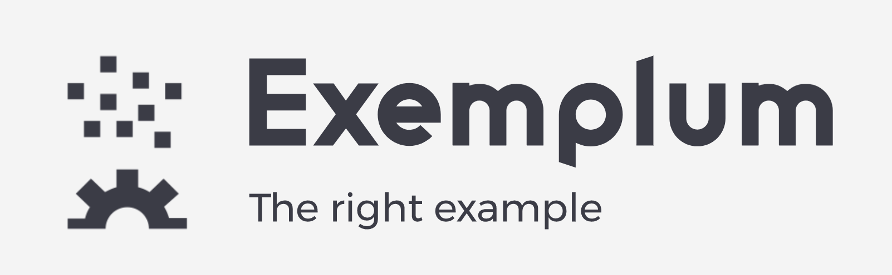

# Exemplum

> An exemplum (Latin for "example", pl. exempla, exempli gratia = "for example", abbr.: e.g.) is a moral anecdote, brief or extended, real or fictitious, used to illustrate a point.

### Todo

Things we need to add to the readme

1. Better intro to the project
1. Feature Folders
1. Hanlders
1. Command Query (CQS and how its different to CQRS) naming conventions for query command and DTO
1. Handler behaviour
1. Handler code organisation
1. Logging
1. Database setup
1. Automapper setup
1. API best practices (routing, resources, rest, paging standard model, DTO)
1. Swagger documentation and how to create controllers that better support it
1. General Code Rules
1. Infrastructure setup (terraform)
1. Build Setup
1. CI setup
1. Code Quality Tools. 

## Docker 

Publish project
`dotnet publish .\src\QandA\QandA.csproj -o ./publish`
Build Container
`docker build -t exemplum -f Dockerfile .`
Run container
`docker run -d -p 8080:80 --name myapp exemplum`
